<div align="center">

# 🪽 Winglet

**The open-source Dots for Hermes Agent. Your agents, in your pocket.**

Named AI agents that live on *your* server, work while you're away,
and tap you on the shoulder when they need you.

[](LICENSE)
[](../../releases)


<br/>

&nbsp;
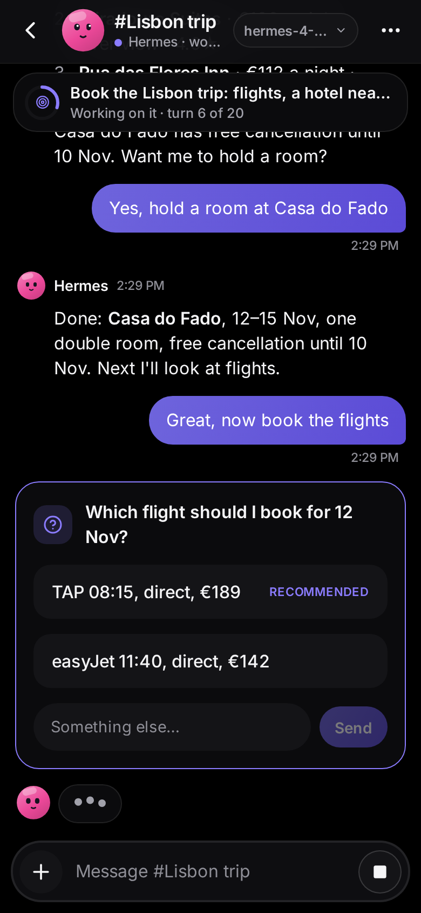&nbsp;
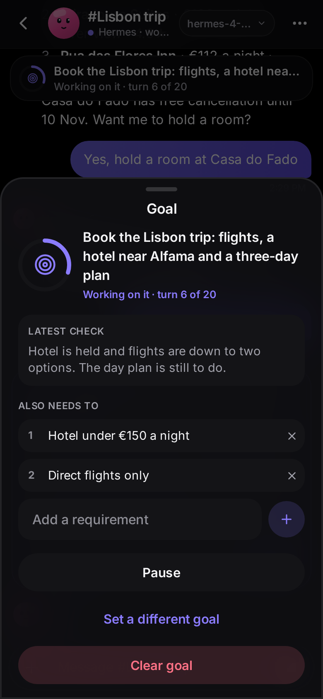&nbsp;
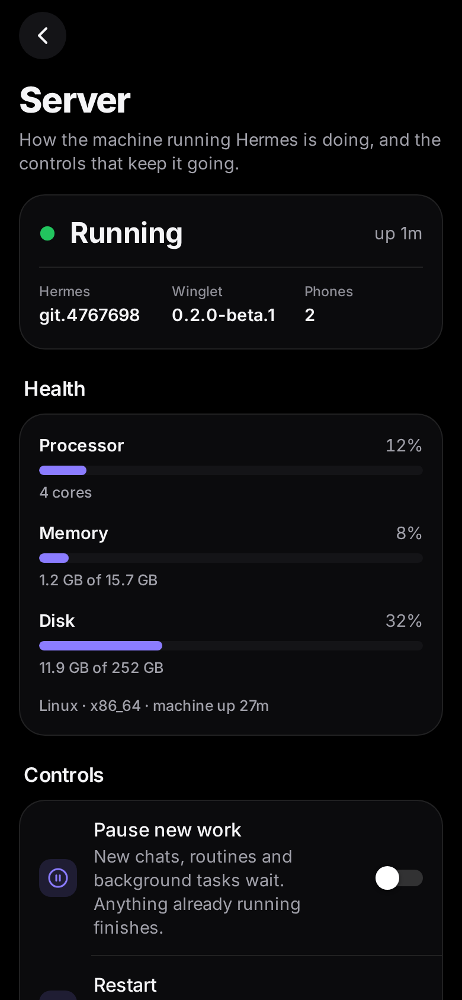

</div>

---

> **Status: v0.2 beta.** Everything below works end to end against a real Hermes gateway, and every
> release builds the Android APK and the iPhone/desktop web app. It's a beta, so expect rough edges, and
> please [open an issue](../../issues) when you hit one.

## What is this?

OpenAI Dots, Meta Muse and Grok Bot showed what a personal agent on your
phone should feel like. Each one has a face and a name, its own computer to
work on, memory, and a way to ping you when it needs a decision.

Winglet brings that experience to [Hermes Agent](https://github.com/NousResearch/hermes-agent),
the open-source agent by Nous Research, running on **your own machine or server**:

- **Your hardware and your models.** Hermes runs on your machine; automatic remote access uses Cloudflare.
- **No app store needed.** Android gets an APK. iPhone gets an installable web app with push notifications.
- **Not another chat window.** Winglet is built around your agents and what they're doing, not around a text box.

## What it does

### Talk to it
- **A chat for every topic.** A main chat plus side chats, each its own Hermes session. Replies stream in
  with Markdown, tables and highlighted code.
- **Photos, files and voice notes**, both ways, with a full-screen viewer. Reply to a message, copy, retry
  or stop a reply, and export a chat.
- **Share from any app** on Android: a page, some text, photos or files go to the chat you pick, ready to
  send with a note.
- **Search every chat** and jump straight to the message. Each chat keeps its **files and photos** in one place.
- **Works on a bad connection.** Chats open from the phone's cache, and what you send waits until the
  server is back.
- **One screen for the connection.** See how phones reach the server, whether the tunnel is up, and
  whether this phone's notifications are getting through. Moved the server to Tailscale or a new domain?
  Point the Android app at the new address; it only moves once your server has signed that address as
  its own.

### It asks, you answer
- **Approvals.** Approve a risky command once, for the session, always, or deny it, from the app or the
  notification.
- **Questions** with one-tap answers, and an **Inbox** for everything waiting on you, across all your bots.
- **Notifications** through Web Push on iPhone and desktop and ntfy on Android, with per-chat mute and
  quiet hours.

### Your agent
- **Models.** Switch the model for one chat from its header, or set the default. Add providers and API keys
  from the phone; keys are encrypted for your server before they leave the phone.
- **Persona, memory and usage.** Edit who it is, see and fix what it remembers, and track tokens and cost.
- **Goals.** Give a chat an outcome and Hermes keeps working on it, turn after turn, until its judge says
  it's done. Add requirements, pause it, and follow its progress in the chat and on Home.
- **Skills, tools and MCP servers.** Turn skills on and off, read them, and install Hermes's official ones.
  Pick the tools it can use and how risky commands get approved. Connect other apps from Hermes's list of
  approved MCP servers and sign in to them from the phone.

### Your server
- **Control center.** Processor, memory and disk at a glance. Pause new work, restart, and update Hermes and
  Winglet with progress that carries on across the restart.
- **Schedule.** Routines in plain words ("weekdays at 9am", "every 2h"), with their results in the Updates chat.
- **Logs** from Hermes, with keys and tokens hidden.
- **Sessions:** every conversation your agent has had, in any app or routine. Search what was said and read
  any of them back, with the tools it used.

### Safe by default
- **Owners and members.** Share your agent with someone without sharing your chats or the controls.
- **Verified pairing** from a QR code, **signed owner actions**, an **activity log** of who changed what,
  and an optional **app lock** on Android.

### Looks good everywhere
- Light and true-black dark themes with accent colors, smooth motion and haptics, a sidebar layout on
  tablets and desktop, and more than one bot side by side.

## Tour

<table>
  <tr>
    <td align="center">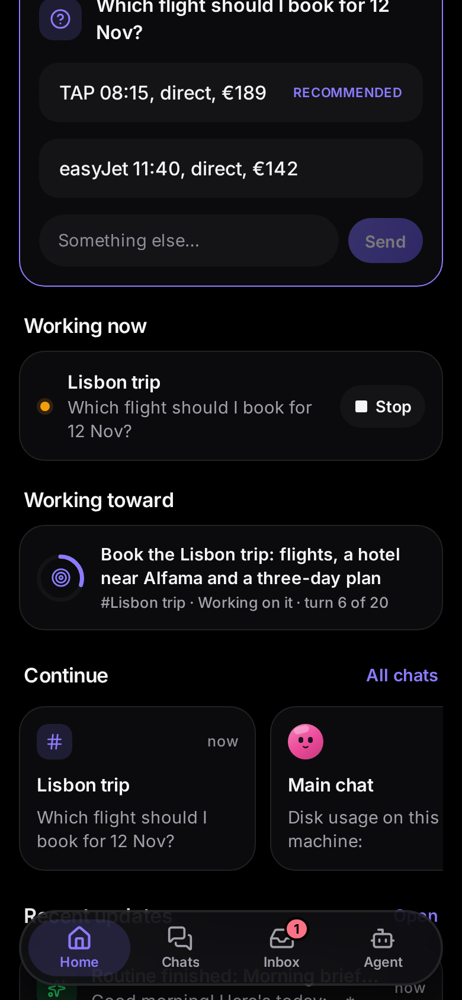<br/><sub>What it's working on</sub></td>
    <td align="center"><br/><sub>Code, highlighted</sub></td>
    <td align="center">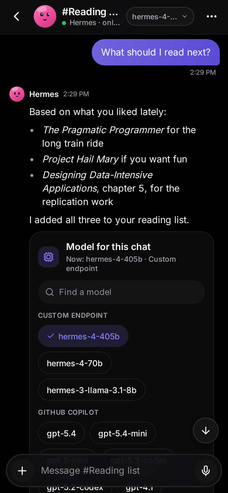<br/><sub>A model per chat</sub></td>
    <td align="center">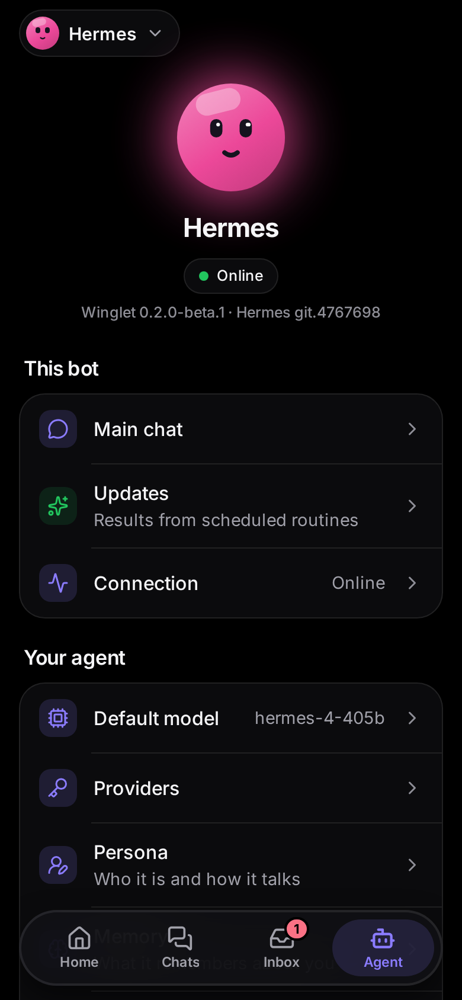<br/><sub>Your agent</sub></td>
  </tr>
  <tr>
    <td align="center">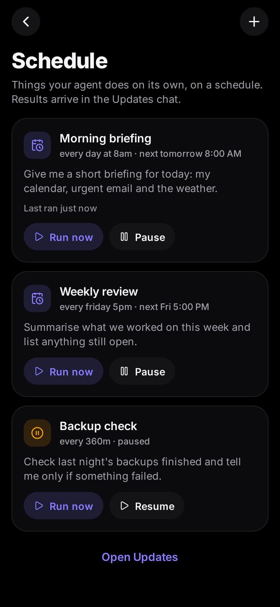<br/><sub>Routines</sub></td>
    <td align="center">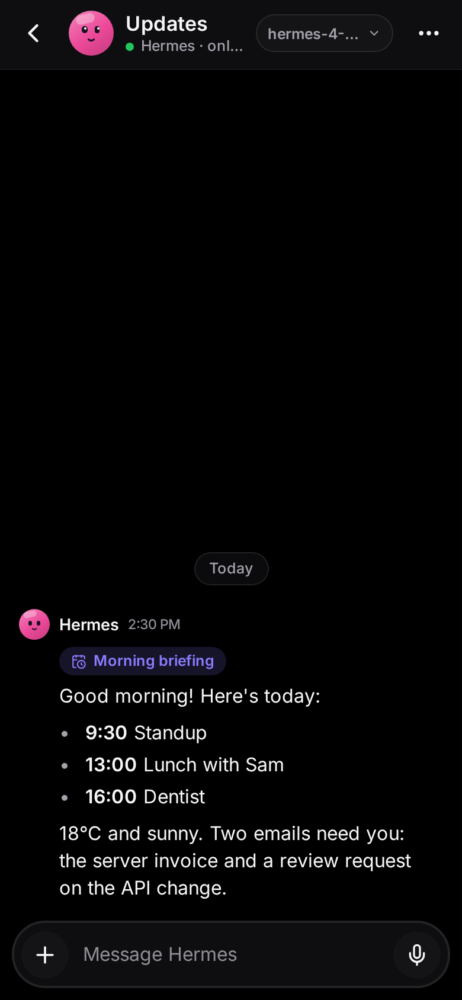<br/><sub>Results in Updates</sub></td>
    <td align="center">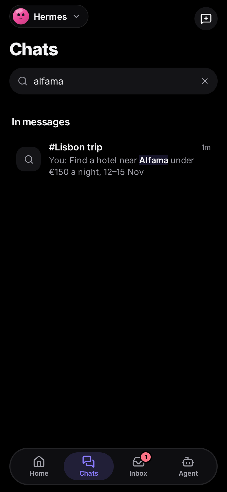<br/><sub>Search every chat</sub></td>
    <td align="center">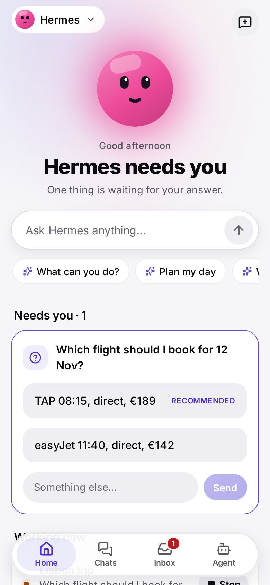<br/><sub>Light mode</sub></td>
  </tr>
</table>

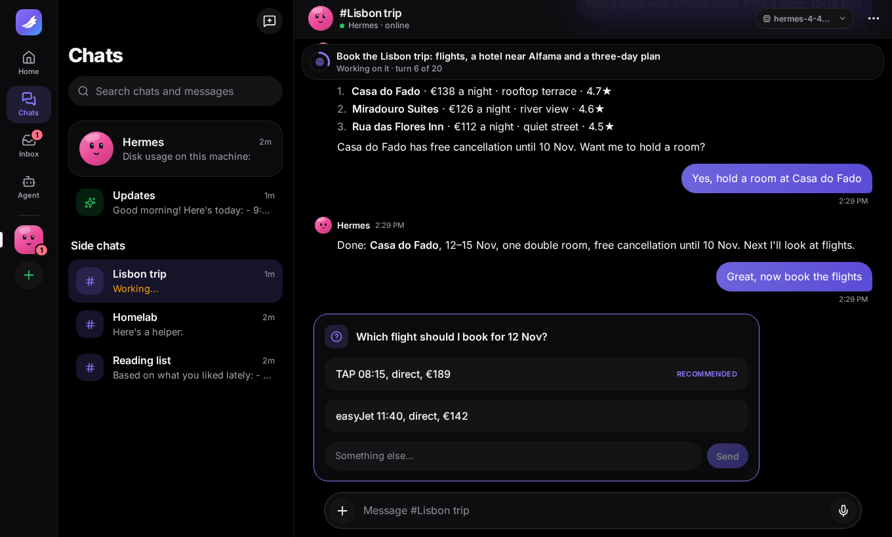

## How it works

```
 ┌──────────────────────┐                ┌──────────────────────────────────────┐
 │  Winglet app         │   HTTPS / WS   │  Your server                         │
 │  • Android (APK)     │ ─────────────▶ │                                      │
 │  • iPhone (web app)  │                │  Hermes gateway                      │
 │  • Desktop browser   │                │   └─ Winglet plugin                  │
 └──────────▲───────────┘                │        • chats ⇄ Hermes sessions     │
            │                            │        • approvals and questions     │
            │   push notifications       │        • goals, schedule, server     │
            └─────────────────────────── │        • pairing, roles, signing     │
               (Web Push / ntfy)         │        • serves the web app          │
                                         └──────────────────────────────────────┘
```

Winglet has two parts:

1. **The app** (`app/`): one [Expo](https://expo.dev) / React Native codebase that builds
   the Android APK and the iPhone/desktop web app.
2. **The plugin** (`plugin/`): a Hermes plugin that adds Winglet as a messaging platform, the same way
   Telegram or Slack plug into Hermes. Each Winglet chat is a Hermes session, and approvals, questions,
   model and setting pickers, goals and routines all go through Hermes's own mechanisms.
   **No fork of Hermes.** Setup provides HTTPS through Cloudflare, or you can use your own connection.

## Install

You need a machine running [Hermes Agent](https://github.com/NousResearch/hermes-agent) with its
messaging gateway (`hermes gateway`), the same one you'd use for Telegram or Slack.

### 1. On your Hermes machine

```bash
hermes plugins install VIKASRP24/winglet/plugin
hermes plugins enable winglet
hermes winglet setup          # prepares HTTPS, starts the gateway, then shows the QR
```

For a new or previously unpaired install, `setup` installs the dependencies and a checksum-verified
Cloudflare tunnel client in your Hermes profile, starts/restarts the gateway, and checks the public HTTPS address against your
server's identity before showing a QR. No Cloudflare account, domain, administrator rights,
inbound port opening, or phone VPN is needed. The server still needs outbound internet access.

The free Quick Tunnel is an early-preview convenience: it has no uptime guarantee and changes
address when recreated. The updated Android app recovers the new address when reconnecting;
iPhone users need a new QR and home-screen installation after an address change. An existing
explicit HTTPS configuration and any saved connection mode are preserved. Older installs with
paired phones keep their direct address and listener, so re-running setup during an upgrade
does not disconnect them or route their traffic through Cloudflare. To switch explicitly, run
`hermes winglet setup --connection quick`, then re-pair those phones. See [remote access](docs/REMOTE_ACCESS.md) for
limits, provider privacy, and permanent-address alternatives.

For live-typing replies, add this to `~/.hermes/config.yaml`:

```yaml
display:
  platforms:
    winglet:
      streaming: true
```

### 2. On your phone

- **Android:** download `winglet-<version>.apk` from [Releases](../../releases), open it, and allow the
  install. Scan the QR code from step 1. Want auto-updates? Add this repo to
  [Obtainium](https://github.com/ImranR98/Obtainium).
- **iPhone:** scan the QR code with the Camera app. It opens Winglet in Safari: tap
  **Share → Add to Home Screen**, open Winglet from your Home Screen, and enter the pairing code.
  Notifications need iOS 16.4+ and an **https** address (see below).
- **Desktop:** open the link from `hermes winglet pair` in any browser.

### Reaching your server from anywhere (and HTTPS for iPhone)

The default automatic HTTPS address works over Wi-Fi or mobile data. Run `hermes winglet pair`
for another phone or a fresh QR. Cloudflare carries HTTP and WebSocket traffic and terminates
HTTPS; this connection is **not end-to-end encrypted against Cloudflare**. Android address
announcements are separately encrypted before being published through ntfy.

For a permanent address or private access, use `--public-url`. For example, install and connect
[Tailscale](https://tailscale.com) on both the Hermes server and phone, then on the server:

```bash
hermes gateway restart
tailscale serve --bg http://127.0.0.1:8787
hermes winglet setup --public-url https://<your-machine>.<your-tailnet>.ts.net
hermes gateway restart
hermes winglet pair
```

Use the exact HTTPS URL printed by `tailscale serve`; keep Tailscale connected on the phone.
Changing `--public-url` does not create HTTPS or update an already paired app connection. To move a
paired Android phone instead of pairing again, set the new address with `--public-url`, restart, then
open the bot's **Connection** screen and choose **Change address**.
An HTTPS domain with a reverse proxy or a
[Cloudflare Tunnel](https://developers.cloudflare.com/cloudflare-one/connections/connect-networks/)
works too. See the [remote access guide](docs/REMOTE_ACCESS.md) for setup and troubleshooting.

### Notifications

Upgrading from an installation that shared one Android notification topic between phones?
Winglet retires that topic automatically to stop revoked phones from receiving notifications.
Set up notifications again on **each phone**, subscribe to its new private topic in ntfy, and remove
the old shared topic. Web Push registrations are unaffected.

- **iPhone / desktop:** Settings → Notifications → *Turn on notifications*. Uses standard Web Push,
  end-to-end encrypted with keys that live on your server.
- **Android:** Settings → Notifications → *Set up notifications*, then subscribe in the free
  [ntfy](https://ntfy.sh) app. ntfy only ever sees "Hermes needs you", never the details.

### Approval compatibility

Interactive approval cards bind to the exact Hermes request ID. Winglet accepts an ID forwarded
with the prompt, or captures it from current Hermes' synchronous approval notifier before the
prompt is scheduled. This compatibility path checks the notifier, adapter, chat, and session;
if Hermes changes that call path or the request has expired, Winglet uses the normal text prompt
with `/approve` and `/deny` instructions. Winglet never guesses an approval identity from the
command or queue order, even when only one request appears to match. See
[approval identity and compatibility](docs/APPROVALS.md) for the integration details and tests.

### More than one bot

Each Hermes profile is a bot. Give each profile its own port and pair them all; they stack up in the
sidebar:

```bash
hermes -p researcher winglet setup --port 8788
hermes -p researcher gateway run
hermes -p researcher winglet pair
```

## Roadmap

**v0.1: Connect** ✅
- [x] Hermes plugin and QR pairing, a home screen of bots
- [x] Chat with streaming, Markdown, files and images
- [x] Inbox, push notifications, approvals and answers from the phone

**v0.2 beta: Every day** ✅
- [x] Fast reconnects, clear connection states, an offline queue, drafts and a chat cache
- [x] The new look: themes, accents, glass, motion, haptics, wide layout
- [x] Photos, files and voice notes, replies, a media viewer, export, mute and quiet hours
- [x] Owners and members, verified pairing, signed owner actions, activity log, app lock
- [x] Model per chat, default model, providers, persona, memory and usage
- [x] Control center: health, pause, restart, updates, logs and schedule
- [x] Goals, message search, and each chat's files and photos

**Next**
- [x] Skills, toolsets and MCP servers from the phone, and limits on members' tools
- [x] Connection settings in one place
- [x] Share into Winglet from other apps
- [ ] Live screen: watch the agent's computer and take over when it needs you
- [ ] Real-time voice
- [x] A sessions browser: read and search every conversation
- [ ] Widgets and backups

The full plan, with priorities and the work behind each item, is in [docs/APP_PLAN.md](docs/APP_PLAN.md).

## FAQ

**Do I need to pay for anything?**
No. Winglet is MIT-licensed and needs no App Store or Play Store account. You need a
machine that runs Hermes Agent and whatever model provider you choose (local models work).

**Does my server need to be public on the internet?**
No. Your phone needs to reach it, which can be through a private VPN such as Tailscale or through
an HTTPS reverse proxy/tunnel. See the [remote access guide](docs/REMOTE_ACCESS.md).

**Is it safe to expose my agent like this?**
Only paired devices can talk to it: pairing codes are single-use and expire after 10 minutes, and each
phone gets its own revocable token (`hermes winglet devices` / `unpair`). The pairing QR carries the
server key's fingerprint, so the phone checks it's really talking to your server. Owner actions
(managing devices, settings, restarts and updates) are signed by a key that never leaves the phone, so a
token copied from a log can chat but can't change anything. Every such action is in Agent → Devices →
Activity. Risky commands still need your approval. Prefer Tailscale or another private network over
opening a port to the internet.

**Can someone else use my agent?**
Yes, as a member: on your phone, open Agent → Devices → Add a device and choose Member (or run
`hermes winglet pair --member`). Members chat in their own chats and can't see yours, approve commands, or
use owner commands like `/model`. They talk to the same agent with the same memory and, unless you limit
them in Agent → Tools, the same tools, so only add people you'd trust with it.

**What can I control from my phone?**
Owners get Agent → Server: the machine's processor, memory and disk, **Pause new work** (Hermes's `/pause`:
new chats, routines and background tasks wait, anything already running finishes), **Restart**, and updates
for Hermes and Winglet with progress that carries on across the restart. **Logs** shows Hermes's agent,
gateway and error logs with keys and tokens hidden, and **Schedule** takes routines in plain words
("weekdays at 9am", "every 2h", "in 30m") and posts their results to the Updates chat. In-app updates need
Hermes installed from git and Winglet installed with `hermes plugins install`; otherwise the app shows the
command to run on the server. Under Agent → Abilities you manage **Skills**, **Tools** (including approvals and
what members can use) and **MCP servers**. Changes to tools apply from the next message; MCP changes apply
when you tap Reconnect.

**Why a web app on iPhone instead of a real app?**
Apple doesn't allow installing apps outside the App Store without a paid developer account,
and free sideloading expires every 7 days and can't receive notifications. An installed web
app can receive notifications and costs nothing.

## Development

```bash
# Plugin tests
pip install aiohttp cryptography httpx pytest pytest-aiohttp
pytest

# App (Expo)
cd app && npm install
npx expo start            # press "w" for web, or scan with a development build
npx tsc --noEmit && npm test

# Rebuild the web app bundled into the plugin
./scripts/build-web.sh
```

To try the plugin against your own Hermes without publishing it, copy `plugin/` to
`~/.hermes/plugins/winglet/` and enable it.

## Contributing

Early days, so everything is open: code, design, naming of things, ideas.
See [CONTRIBUTING.md](CONTRIBUTING.md). Found a security issue? Please read [SECURITY.md](SECURITY.md) first.

## Disclaimer

Winglet is an independent community project. It is **not affiliated with or endorsed by
Nous Research, OpenAI, Meta or xAI**. "Hermes Agent" is a project of Nous Research;
other product names are used only to describe what Winglet is similar to.

## License

[MIT](LICENSE)
