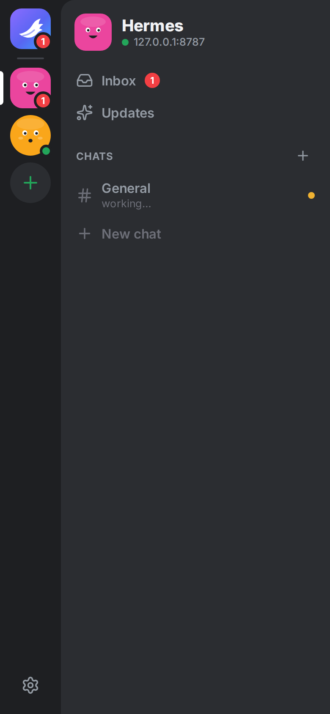
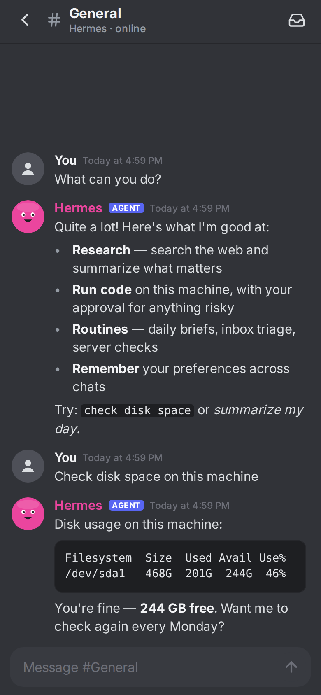
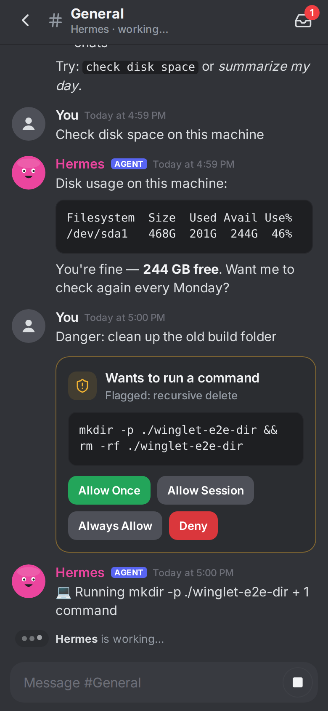
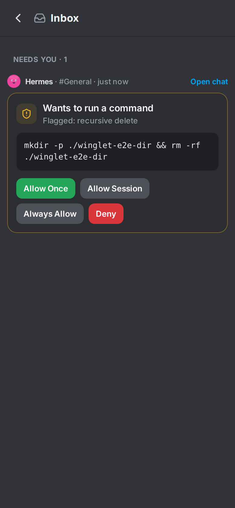

<div align="center">

# 🪽 Winglet

**The open-source Dots for Hermes Agent. Your agents, in your pocket.**

Named AI agents that live on *your* server, work while you're away,
and tap you on the shoulder when they need you.

[](LICENSE)


<br/>

&nbsp;
&nbsp;
&nbsp;


</div>

---

> **Status: v0.1 early preview.** Chat, approvals, questions, inbox and notifications work end to end
> against a real Hermes gateway. Expect rough edges, and please [open an issue](../../issues) when you hit one.

## What is this?

OpenAI Dots, Meta Muse and Grok Bot showed what a personal agent on your
phone should feel like. Each one has a face and a name, its own computer to
work on, memory, and a way to ping you when it needs a decision.

Winglet brings that experience to [Hermes Agent](https://github.com/NousResearch/hermes-agent),
the open-source agent by Nous Research, running on **your own machine or server**:

- **Your hardware, your models, your data.** No vendor cloud in the loop.
- **No app store needed.** Android gets an APK. iPhone gets an installable web app with push notifications.
- **Not another chat window.** Winglet is built around your agents and what they're doing, not around a text box.

## Features

| | Feature | What it means | |
|---|---|---|---|
| 🤖 | **Your bots** | A home screen of named agents, each with a face, a description and live status | ✅ v0.1 |
| 💬 | **Chat** | Separate chats per topic, streaming replies, Markdown, code, files and images | ✅ v0.1 |
| ✅ | **Approvals** | Approve once, for the session, always, or deny, from the app or the notification | ✅ v0.1 |
| ❓ | **Questions** | When a bot needs a decision, answer with one tap | ✅ v0.1 |
| 📥 | **Inbox** | One place for everything that needs you, across all your bots | ✅ v0.1 |
| 🔔 | **Push** | Your phone buzzes when a bot needs you, even when the app is closed | ✅ v0.1 |
| 📷 | **QR pairing** | Scan a code from your server and you're connected. No typing keys | ✅ v0.1 |
| 🖥️ | **Live screen** | Watch a bot use its computer and take over when it needs you (logins, 2FA, captchas) | v0.2 |
| 📞 | **Call your bot** | Real-time voice conversation | v0.2 |
| 🎯 | **Goals & routines** | See what each bot is working toward and what's scheduled next | v0.3 |

## How it works

```
 ┌──────────────────────┐                ┌───────────────────────────────────┐
 │  Winglet app         │   HTTPS / WS   │  Your server                      │
 │  • Android (APK)     │ ─────────────▶ │                                   │
 │  • iPhone (web app)  │                │  Hermes gateway                   │
 │  • Desktop browser   │                │   └─ Winglet plugin               │
 └──────────▲───────────┘                │        • chats ⇄ Hermes sessions  │
            │                            │        • approvals & questions    │
            │   push notifications       │        • QR pairing, devices      │
            └─────────────────────────── │        • push notifications       │
               (Web Push / ntfy)         │        • serves the web app       │
                                         └───────────────────────────────────┘
```

Winglet has two parts:

1. **The app** (`app/`): one [Expo](https://expo.dev) / React Native codebase that builds
   the Android APK and the iPhone/desktop web app.
2. **The plugin** (`plugin/`): a Hermes plugin that adds Winglet as a messaging platform, the same way
   Telegram or Discord plug into Hermes. Each Winglet chat is a Hermes session, and approvals,
   questions and routine results flow through Hermes' own mechanisms.
   **No fork of Hermes, and no third-party relay.**

## Install

You need a machine running [Hermes Agent](https://github.com/NousResearch/hermes-agent) with its
messaging gateway (`hermes gateway`), the same one you'd use for Telegram or Discord.

### 1. On your Hermes machine

```bash
hermes plugins install VIKASRP24/winglet/plugin
hermes plugins enable winglet
hermes winglet setup
hermes gateway restart        # or: hermes gateway run
hermes winglet pair           # shows a QR code
```

For live-typing replies, add this to `~/.hermes/config.yaml`:

```yaml
display:
  platforms:
    winglet:
      streaming: true
```

### 2. On your phone

- **Android:** download `winglet-<version>.apk` from [Releases](../../releases), open it, and allow the
  install. Scan the QR code from step 1. Want auto-updates? Add this repo to
  [Obtainium](https://github.com/ImranR98/Obtainium).
- **iPhone:** scan the QR code with the Camera app. It opens Winglet in Safari: tap
  **Share → Add to Home Screen**, open Winglet from your Home Screen, and enter the pairing code.
  Notifications need iOS 16.4+ and an **https** address (see below).
- **Desktop:** open the link from `hermes winglet pair` in any browser.

### Reaching your server from anywhere (and HTTPS for iPhone)

On the same Wi-Fi, the plain `http://<your-ip>:8787` address works for Android. For iPhone
notifications and for access away from home, put Winglet behind HTTPS. The easiest way is
[Tailscale](https://tailscale.com) (free for personal use):

```bash
tailscale serve --bg 8787
hermes winglet setup --public-url https://<your-machine>.<your-tailnet>.ts.net
hermes winglet pair
```

A [Cloudflare Tunnel](https://developers.cloudflare.com/cloudflare-one/connections/connect-networks/)
works too.

### Notifications

- **iPhone / desktop:** Settings → Notifications → *Turn on notifications*. Uses standard Web Push,
  end-to-end encrypted with keys that live on your server.
- **Android:** Settings → Notifications → *Set up notifications*, then subscribe in the free
  [ntfy](https://ntfy.sh) app. ntfy only ever sees "Hermes needs you", never the details.

### More than one bot

Each Hermes profile is a bot. Give each profile its own port and pair them all; they stack up in the
sidebar:

```bash
hermes -p researcher winglet setup --port 8788
hermes -p researcher gateway run
hermes -p researcher winglet pair
```

## Roadmap

**v0.1: Connect**
- [x] Hermes plugin + QR pairing
- [x] Bots home screen, multiple bots
- [x] Chat with streaming, Markdown, files and images
- [x] Inbox + push notifications (Web Push for iPhone/desktop, ntfy for Android)
- [x] Approvals and answers to the agent's questions, from the phone

**v0.2: The wow**
- [ ] Live screen: watch and take over a bot's computer
- [ ] Call your bot (real-time voice)

**v0.3: Daily driver**
- [ ] Goals, routines and activity timeline
- [ ] Multiple servers
- [ ] Widgets / shortcuts where the platform allows

## FAQ

**Do I need to pay for anything?**
No. Winglet is MIT-licensed and needs no App Store or Play Store account. You need a
machine that runs Hermes Agent and whatever model provider you choose (local models work).

**Does my server need to be public on the internet?**
Your phone needs to reach it. On the same Wi-Fi works; for away-from-home, use something
like Tailscale or a Cloudflare Tunnel. Setup guides will come with v0.1.

**Is it safe to expose my agent like this?**
Only paired devices can talk to it: pairing codes are single-use and expire after 10 minutes, and each
phone gets its own revocable token (`hermes winglet devices` / `unpair`). Risky commands still need your
approval. Prefer Tailscale or another private network over opening a port to the internet.

**Why a web app on iPhone instead of a real app?**
Apple doesn't allow installing apps outside the App Store without a paid developer account,
and free sideloading expires every 7 days and can't receive notifications. An installed web
app can receive notifications and costs nothing.

## Development

```bash
# Plugin tests
pip install aiohttp cryptography httpx pytest pytest-aiohttp
pytest

# App (Expo)
cd app && npm install
npx expo start            # press "w" for web, or scan with a development build
npx tsc --noEmit

# Rebuild the web app bundled into the plugin
./scripts/build-web.sh
```

To try the plugin against your own Hermes without publishing it, copy `plugin/` to
`~/.hermes/plugins/winglet/` and enable it.

## Contributing

Early days, so everything is open: code, design, naming of things, ideas.
See [CONTRIBUTING.md](CONTRIBUTING.md). Found a security issue? Please read [SECURITY.md](SECURITY.md) first.

## Disclaimer

Winglet is an independent community project. It is **not affiliated with or endorsed by
Nous Research, OpenAI, Meta or xAI**. "Hermes Agent" is a project of Nous Research;
other product names are used only to describe what Winglet is similar to.

## License

[MIT](LICENSE)
